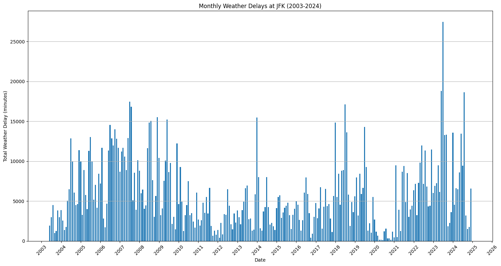
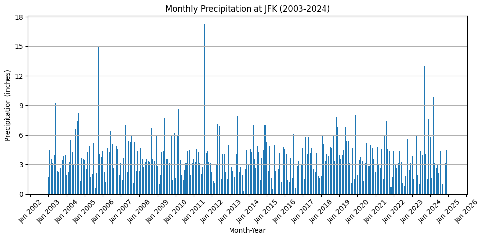
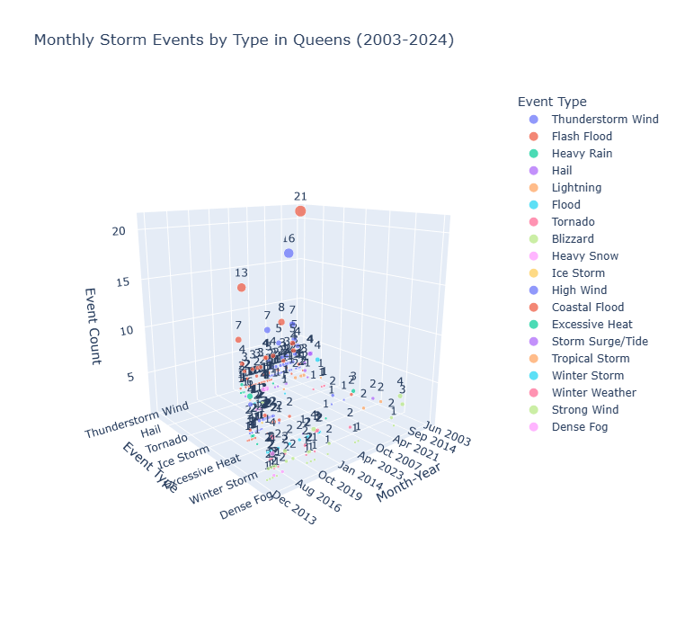
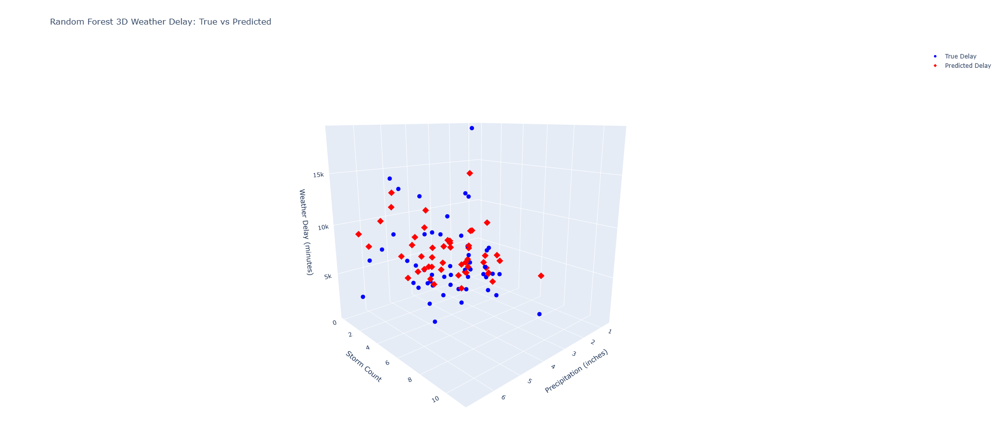
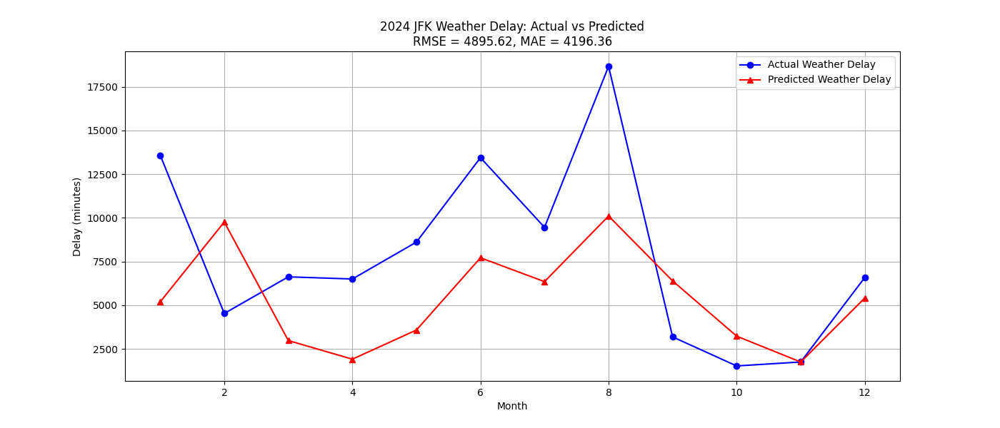

# CS506 Project: Airport Flight Delay Prediction Final Report

## Goal
Our goal is to create a model that can accurately predict an airports' total length of delay (in minutes) each month caused by weather. Using weather data such as total monthly precipitation, and storm count per month in that specific airports' location to help us train the model.

## Setup
1. Clone the repository.
2. In the root of the repository, install all the necessary dependencies using "make install".
3. Train our model using "make train".
4. Test and see the model's result using "make test".

## Data Cleaning
We are using airport data from the U.S. Bureau of Transportation Statistics. This data includes all airlines, airports in the United States, the type of delays, and cancellations every month from June 2003 to December 2024. We are only taking into consideration the flights that leave and arrive at JFK by filtering out all airports except JFK. Furthermore, we only considered delays caused by weather to decrease variations needed for our model to consider, as not all delays happen for the same reason. For example, some delays could happen due to security reasons. 

Additionally, we are using weather data from 2003 to 2024 from the National Oceanic and Atmospheric Administration (NOAA) to account for various weather events that can cause weather delays in JFK. In specific, we took consideration of events such as thunderstorms, blizzards and strong winds as these events have a higher chance of impacting airport functions, while filtering out less impactful events such as rip currents.  

Finally, we filtered out all airport and weather data from 2024 in our training model to ensure fair model evaluation, since we will be testing our model's flight delay prediction capability in 2024.

## Data Visualization

### Monthly Weather Delays at JFK (2003–2024)

This bar chart shows the total number of weather-related delay minutes at JFK Airport on a monthly basis from 2003 to 2024. 
- Peaks in delays are observed around 2007–2008 and again in 2023–2024.
- Notable spikes suggest extreme weather or possibly systemic disruptions during these periods.
- There is significant month-to-month variability, reflecting the unpredictable nature of weather impacts on flight operations.

---

### Monthly Precipitation at JFK (2003–2024)

This graph displays monthly total precipitation (in inches) at JFK from 2003 to 2024.
- Most months experience 2–5 inches of rainfall.
- Several extreme precipitation months are visible, particularly around 2005, 2011, and 2023.
- Although some correlation with flight delays may be expected, precipitation alone does not fully explain delay patterns.

---

### Monthly Storm Events by Type in Queens (2003–2024)

- **Thunderstorm Wind**, **Flash Flood**, and **Winter Weather** are among the most frequently recorded event types.
- Some months, particularly during hurricane seasons or winters, show higher counts of events.
- The diversity and intensity of storm types could help explain spikes in flight delays and disruptions in specific months.

---
These graphs collectively illustrate how varying weather patterns — including rainfall and storm events — have historically impacted flight delays at JFK. Significant variability year-over-year emphasizes the need for resilient scheduling and operational flexibility in aviation planning.

### Random Forest Predictions

This 3D scatter plot visualizes the relationship between:
- **Precipitation (x-axis)**
- **Storm Event Count (y-axis)**
- **Weather Delay in Minutes (z-axis)**

Data points:
- **Blue markers:** True delay values.
- **Red markers:** Predicted delay values.

The scatter pattern shows the Random Forest model learning complex, non-linear interactions between precipitation, storm activity, and resulting flight delays. While predictions are close overall, the spread suggests variance in model accuracy at extreme values.

If you want to access the interactive graph, you are going to need to run the 3d_rfmodel_weather_delay.html file in the images folder on a live server. The easiest way to do this is to use Vscode and install the live server extension. Then right-click the html file and click the option "Open with live server".

---
### 2024 JFK Weather Delay: Actual vs Predicted

This line plot compares the **actual** and **predicted** monthly total weather delays at JFK Airport for the year 2024.
- **Blue line:** Actual recorded delay minutes.
- **Red line:** Predicted delay minutes from the machine learning model.
- **Performance Metrics:**
  - **Root Mean Squared Error (RMSE):** 4895.62 minutes
  - **Mean Absolute Error (MAE):** 4196.36 minutes
- Overall, the model captures seasonal trends, although some months (e.g., January and August) show larger prediction errors.

## Data Modeling Methods
We explored many different data modeling methods to predict weather induced delays for JFK airport. After the data processing, I experimented with several data modeling methods to predict monthly weather delays at JFK Airport. I initially tested a Linear Regression model, but it didn’t really capture the nonlinear relationships between weather features and delay times. Then I tried to implement a Support Vector Machine model, which provided better prediction accuracy but was sensitive to parameter tuning and didn't generalize well on unseen testing data. Both of these models returned predictions on the test split that were on a flat plane. I tried using a K-Nearest Neighbors model again, similar to the midterm report, which performed reasonably well by predicting delays based on similar past months. However, KNN became limited as it does not build a general model and instead heavily depends on the stored data, making it less scalable and more sensitive to noise. For the final report, I ultimately decided to use Random Forest Regressor, which is an ensemble learning method that builds multiple decision trees and averages their results. Random Forest predicted the weather delay times better than the other models. By averaging the outputs of many trees, it also reduced the risk of overfitting which made it more stable when generalizing to new data like the 2024 weather information. Overall, Random Forest handled the low dimensional data more effectively by being both flexible and robust.

## Improvement from the Midterm Report

Since the midterm report, we made significant progress and expanded the project in several important ways:

- **Expanded Feature Set:**  
  In the midterm, we primarily used precipitation and temperature to predict flight delays. For the final report, we incorporated an additional feature: **storm event count** (e.g., thunderstorms, flash floods, winter storms), while removing average monthly temperature, since temperature has a less direct impact than storm events. This allowed our models to better capture the intensity and variability of monthly weather patterns.

- **Broader Data Range:**  
  Initially, we only analyzed weather and delay data from 2024. In the final report, we expanded our dataset to include 5 years of data from 2019 to 2024 then a larger **historical data from 2003 to 2024**. This provided a much larger training set, helping improve model generalization and robustness.

- **Advanced Modeling Techniques:**  
  While the midterm report focused on K-Nearest Neighbors (KNN) for preliminary predictions, the final project introduced a **Random Forest Regressor**. Random Forest, being an ensemble method, allowed us to better model the complex, nonlinear relationships between weather features and flight delays, resulting in more accurate predictions.

- **Performance Evaluation:**  
  In the midterm report, model evaluation was primarily qualitative. For the final report, we quantitatively evaluated model performance using **Root Mean Squared Error (RMSE)** and **Mean Absolute Error (MAE)**. These metrics provided a clearer assessment of how well our model predicts delays.

- **Interactive 3D Visualization:**  
  We enhanced our visual analysis by creating an **interactive 3D plot** showing the relationship between precipitation, storm counts, and weather delays. This plot helped us (and future users) better understand the patterns the model learned.

- **Improved Data Visualizations:**  
  In addition to new modeling, we developed a richer set of visualizations:
  - Weather delay trends over 20+ years
  - Precipitation patterns
  - Storm event types over time
  - True vs predicted weather delays both in 2D (line graph) and 3D (scatter plot)

Overall, we moved from a simple exploratory analysis to a more rigorous predictive modeling project with a broader feature set, better model performance, and more sophisticated visualizations.

