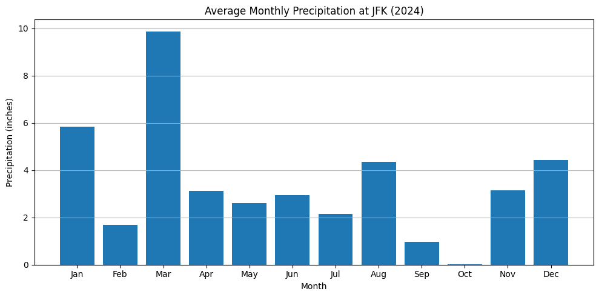
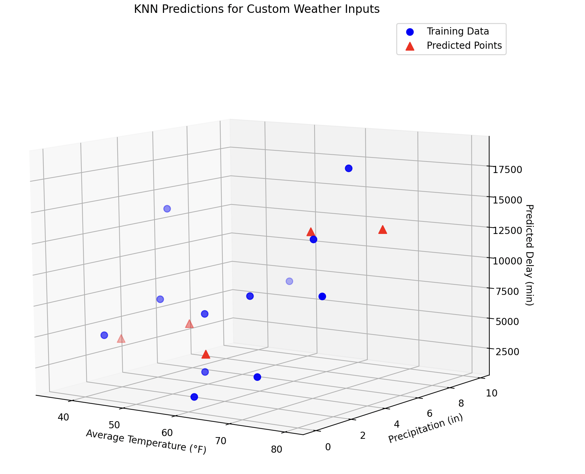

# CS506 Project: Airport Flight Delay Prediction Midterm Report

## Goal
The ability to predict an airports's length of weather delay in minutes is what we hope our model will achieve. Using weather data like the amount of precipitation and the average temperature per month in that specific airports' location to help us train the model.

## Data Cleaning
We are using historical data records of airports to do this, specifically airport records from the year 2024. The dataset includes data from all 12 months within that year. We are only taking into consideration the flights that leave and arrive at JFK, filtering out all other airports. Additionally, we are only considering delays affected by weather to reduce the number of variables that need to be considered, as not all delays happen for the same reason. Some delays may occur due to security issues or other factors. Therefore, we have filtered out all non-weather-related delays from the total delays recorded at JFK.

## Data Visualization

### JFK Average Monthly Temperature 

This line chart illustrates the average monthly temperature recorded at JFK Airport in 2024. It shows a typical seasonal pattern where temperatures peak in the summer months (July and August) and drop during the winter months (January and December).

### JFK Average Monthly Precipitation 

This bar chart shows the monthly average precipitation recorded at JFK Airport in 2024. April appears to have the highest level of precipitation, which could indicate a higher likelihood of weather-related delays during that month.

### JFK Average Monthly Weather Delay 

This bar chart displays the total weather-related delay time (in minutes) at JFK per month in 2024. The data indicates that August experienced the highest number of delays, which may correlate with increased precipitation or extreme weather conditions during that time.

### KNN Predictions 

This 3D scatter plot visualizes the K-Nearest Neighbors (KNN) predictions for weather-based flight delays. The blue points represent the training data, while the red triangles represent the predicted delay times based on given temperature and precipitation values. This visualization helps us see how weather conditions correlate with flight delays.

## Data Modeling Methods
We have explored multiple modeling approaches to predict weather-induced flight delays. Initially, we performed exploratory data analysis (EDA) to identify key patterns and correlations between weather conditions and delay times. Additionally, we implemented K-Nearest Neighbors (KNN) to leverage similarities in weather conditions for delay estimation. We are exploring more advanced machine learning models in future uses, such as decision trees and ensemble methods, to enhance predictive accuracy.

## Preliminary Results
Our preliminary results show promising trends in predicting weather-related delays. The KNN model performed better in detecting clusters of delays based on historical weather conditions. Moving forward, we aim to refine our models by incorporating additional features and optimizing hyperparameters to improve accuracy.

