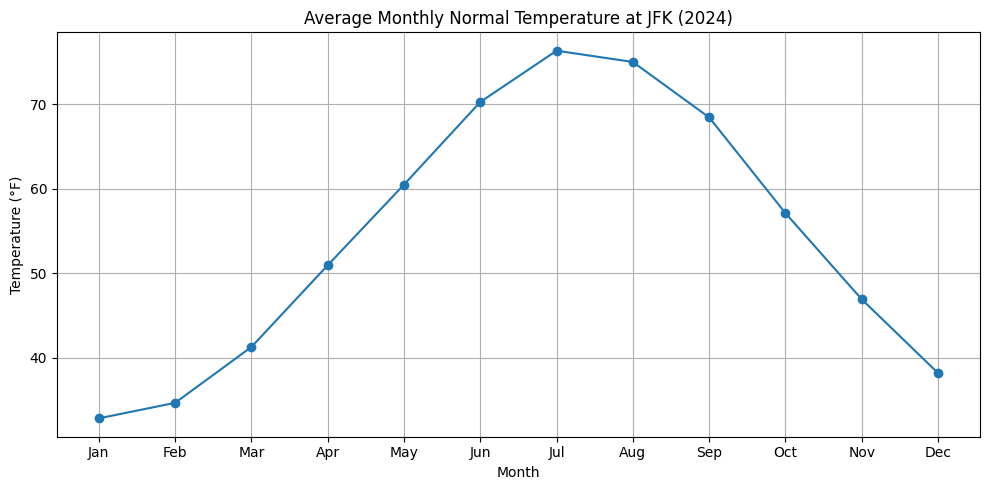
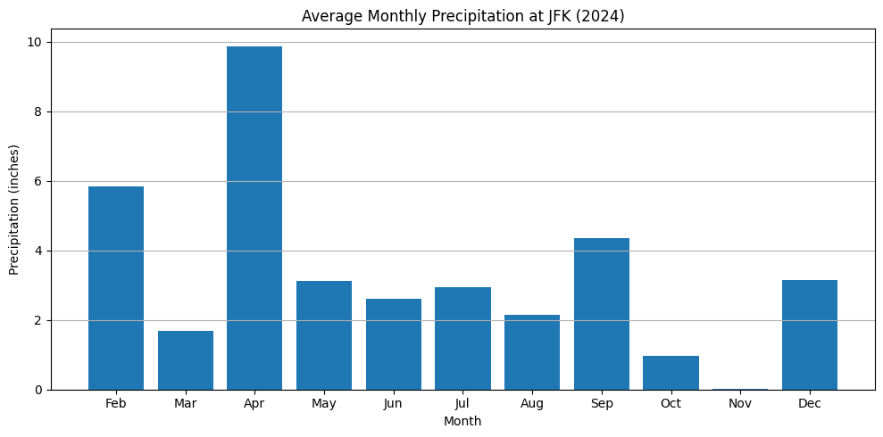
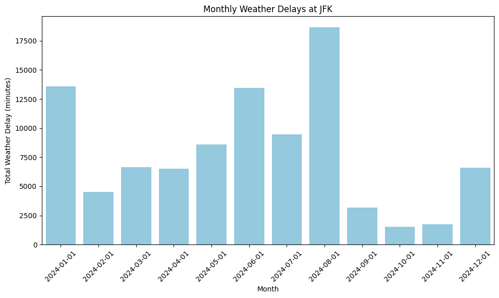

# CS506 Project: Airport Flight Delay Prediction Midterm Report

## Goal
The ability to predict an airports's length of weather delay in minutes is what we hope our model will achieve. Using weather data like the amount of precipitation and the average temperature per month in that specific airports' location to help us train the model.

## Data Cleaning
We are using old data records of airports to do this specifically airport records from teh year 2024. So the data would only include data from the 12 months within that year. We are only taking into consideration the flights that leave and arrive at the JFK, so we can filtering out all airports expect for JFK. We are only considering delays that are effected by weather so we can lower the amount of variablabilies that we need to consider as not all delays happen for the same reason, as some delays could happen due to security reasons. So we would also filter out all other reasons of delay expect weather out of the total delays that JFK have had in.

## Data Visualization

This line chart illustrates the average monthly temperature recorded at JFK Airport in 2024. It shows a typical seasonal pattern where temperatures peak in the summer months (July and August) and drop during the winter months (January and December).

This bar chart shows the monthly average precipitation recorded at JFK Airport in 2024. April appears to have the highest level of precipitation, which could indicate a higher likelihood of weather-related delays during that month.

This bar chart displays the total weather-related delay time (in minutes) at JFK per month in 2024. The data indicates that August experienced the highest number of delays, which may correlate with increased precipitation or extreme weather conditions during that time.
